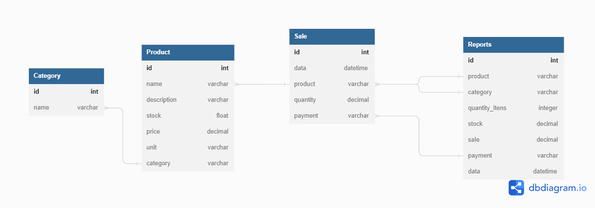

# Info

##  Requisitos Obrigatórios ##
- Python
- Poetry
- Docker
- Git

## Estrutura do projeto ##
```bash
|--GroceryStoreAPI/ (APLICAÇÃO PRINCIPAL)
|   |-- .github/
|   |   |-- workflows/
|   |   |   |-- ci-cd.yml
|   |-- src/
|   |	|-- apps/ (PASTA DE APPS)
|   |	|	|-- authorizarion/ (APP DJANGO)
|   |	|	|	|-- apps.py
|   |	|	|	|-- models.py
|   |	|	|	|-- urls.py
|   |	|	|	|-- views.py
|   |	|	|-- products/ (APP DJANGO)
|   |	|	|	|-- tests/ (PASTA PARA TESTES)
|   |	|	|	|	|-- test_categories.py
|   |	|	|	|	|-- test_products.py
|   |	|	|	|-- admin.py
|   |	|	|	|-- apps.py
|   |	|	|	|-- models.py
|   |	|	|	|-- serializers.py
|   |	|	|	|-- urls.py
|   |	|	|	|-- views.py
|   |	|	|-- reports/ (APP DJANGO)
|   |	|	|	|-- tests/ (PASTA PARA TESTES)
|   |	|	|	|	|-- test_reports.py
|   |	|	|	|-- admin.py
|   |	|	|	|-- apps.py
|   |	|	|	|-- models.py
|   |	|	|	|-- serializers.py
|   |	|	|	|-- urls.py
|   |	|	|	|-- views.py
|   |	|	|-- sales/ (APP DJANGO)
|   |	|	|	|-- tests/ (PASTA PARA TESTES)
|   |	|	|	|	|-- test_sales.py
|   |	|	|	|-- admin.py
|   |	|	|	|-- apps.py
|   |	|	|	|-- models.py
|   |	|	|	|-- serializers.py
|   |	|	|	|-- urls.py
|   |	|	|	|-- views.py
|   |	|-- mixins/
|   |	|   |-- log.py
|   |	|-- project/ (PROJECT DJANGO)	
|   |	|	|-- asgi.py
|   |	|	|-- settings.py
|   |	|	|-- urls.py
|   |	|	|-- wsgi.py
|   |   |-- manage.py
|   |-- docs/
|   |	|-- assets/ (PASTA DE IMAGENS)
|   |	|	|-- admin/ (IMAGENS DO DJANGO-ADMIN)
|   |	|	|-- api/ (IMAGENS DO FUNCIONAMENTO DAS ROTAS)
|   |	|	|-- auth/ (IMAGENS DA AUTENTICAÇÃO)
|   |	|	|-- celery/ (IMAGENS DO CELERY)
|   |	|	|-- database/ (IMAGENS DO RELECIONAMENTO DAS TABELAS)
|   |	|	|-- docker/ (IMAGENS DO DOCKER)
|   |	|	|-- pytest/ (IMAGENS DOS TESTES EXECUTADOS)
|   |	|	|-- redis/ (IMAGENS DO REDIS)
|   |	|	|-- swagger/ (IMAGENS DA DOCUMENTAÇÃO SWAGGER)
|   |   | ...
|-- .dockerignore
|-- .env
|-- .gitignore
|-- docker-compose.yaml
|-- Dockerfile
|-- LICENSE
|-- logfile.log
|-- Makefile
|-- mkdocs.yml
|-- poetry.lock
|-- pyproject.toml
|-- pytest.ini
|-- README.md
|-- requirements.txt

```

## Relacionamento de tabelas do Banco de Dados ##



Para criar imagens para um melhor entendimento das tabelas do banco de dados, utilize o site <a href="https://dbdiagram.io/" target="_blank">dbdiagram.io</a>

