# API REST 
API é uma sigla do inglês que significa Application Programming Interface que traduzindo seria uma Interface de Programação de Aplicativos.

APIs são mecanismos que permitem que dois componentes de software se comuniquem usando um conjunto de definições e protocolos. Por exemplo, o sistema de software do instituto meteorológico contém dados meteorológicos diários.

Para a utilização da API REST do mercadinho, foi feito um CRUD para as tabelas do banco de dados mais importantes, e outras apenas rotas de GET e POST.

## Categoria ##
Para ver, adicionar e deletar as categorias dos produtos do seu mercadinho, você deve utilizar as rotas com o End-Point:
- /api/categories/

#### Visualizar categorias ####
Para visualizar as categorias cadastradas você deve utilizar o método HTTP GET no End-Point abaixo para visualizar todas as categorias cadastradas
- http://localhost/api/categories/ (MÉTODO HTTP GET) 

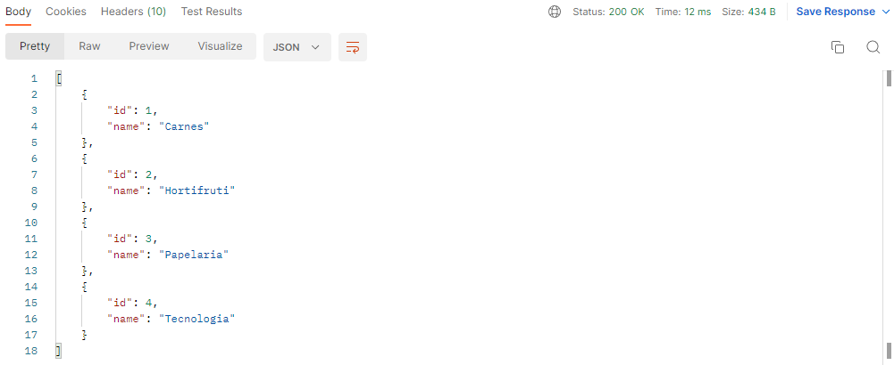

Caso deseje visualizar apenas uma categoria específica, você poderá adicionar o ID no final do End-Point.

- http://localhost/api/categories/{ID}/ (MÉTODO HTTP GET)

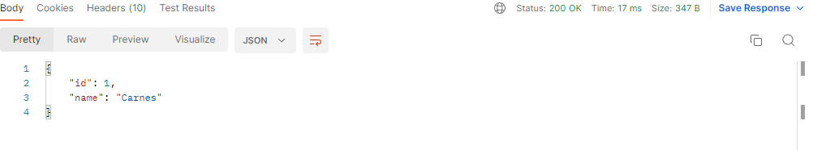

#### Adicionar categorias ####
Para adicionar categorias você deve utilizar o End-Point principal descrito acima e passar um JSON com os parametros necessários para o cadastramento.
- http://localhost/api/categories/ (MÉTODO HTTP POST)

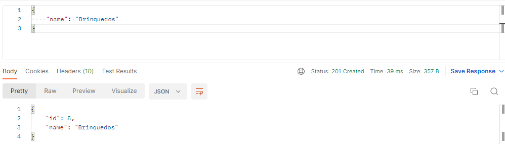

#### Deletar categorias ####
Para deletar categorias existentes você deve utilizar o End-Point principal, passando na URL o ID da categoria específica que deseja deletar
- http://localhost/api/categories/{ID}/ (MÉTODO HTTP DELETE)

OBS: Só é possivel deletar categorias existentes, caso o ID passado não exista você será avisado.

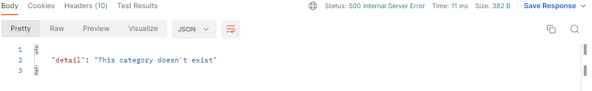

OBS: Só é possivel deletar que não estão sendo usadas, caso a categoria passada esteja em uso por algum produto, você será avisado.

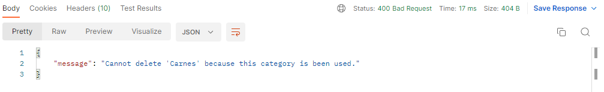

## Produtos ##
Para ver, adicionar, deletar e atualizar os produtos no seu mercadinho, você deve utilizar as rotas com o End-Point:
- /api/products/

#### Visualizar produtos ####
Para visualizar os produtos cadastrados você deve utilizar o método HTTP GET no End-Point acima para visualizar todos os produtos cadastrados
- http://localhost/api/products/ (MÉTODO HTTP GET)

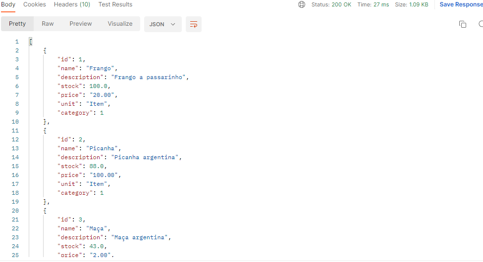

Caso deseje visualizar apenas um produto, você poderá adicionar o ID no final do End-Point.

- http://localhost/api/products/{ID}/ (MÉTODO HTTP GET)

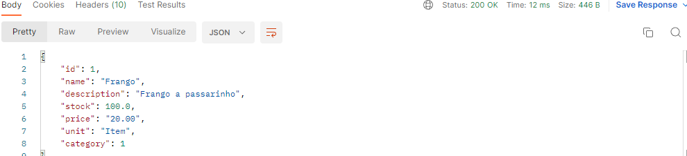

#### Adicionar produtos ####
Para adicionar produtos você deve utilizar o End-Point principal descrito acima e passar um JSON com os parametros necessários para o cadastramento.
- http://localhost/api/products/ (MÉTODO HTTP POST)

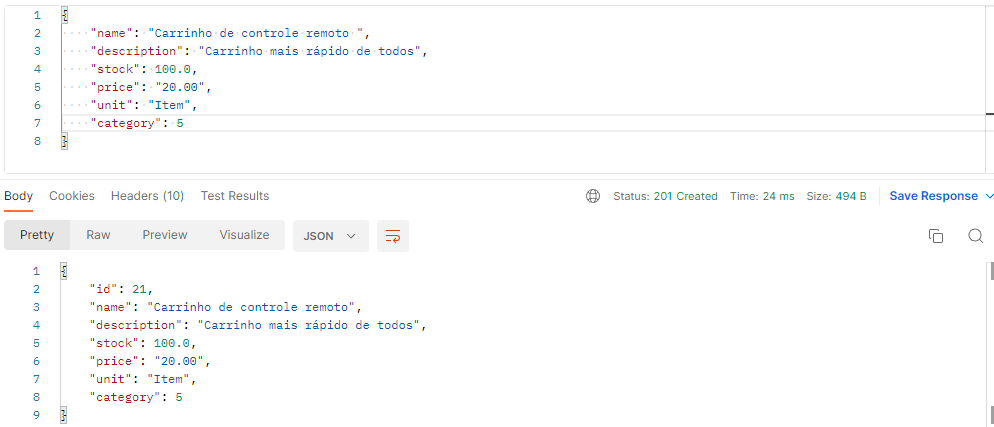

OBS: O cadastramento de produtos só é possivel tendo um categoria já cadastrada no banco de dados, caso não tenha, você será avisado.

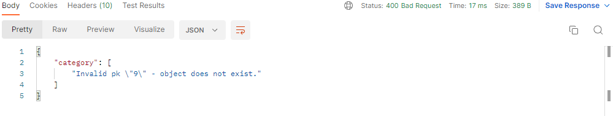

OBS: O cadastramento de produtos só é possivel para um produto novo, caso o produto já exista, você será avisado.

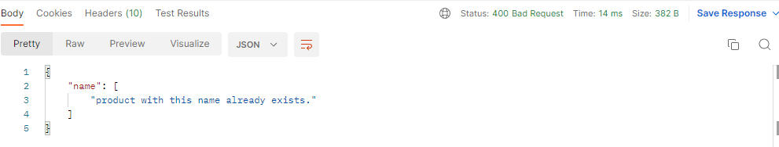

#### Atualizar produtos ####
Para atualizar os produtos existentes você deve utilizar o End-Point principal, passando na URL o ID do produto específico que deseja atualizar e passar um JSON com os parametros necessários para a atualização.
- http://localhost/api/products/{ID}/ (MÉTODO HTTP PUT)

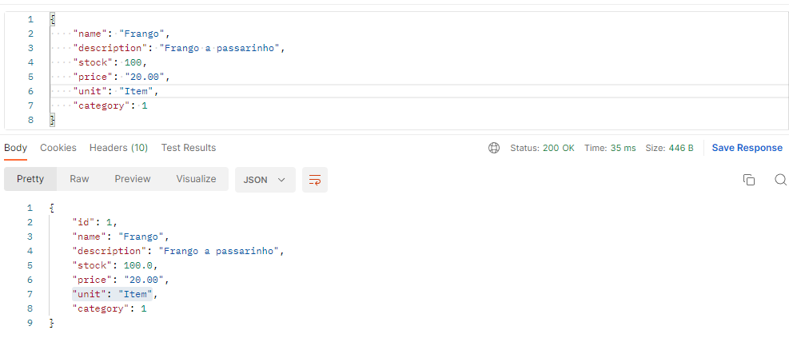

OBS: A atualização de produtos só é possivel tendo o produto já cadastrado no banco de dados, caso não tenha, você será avisado.

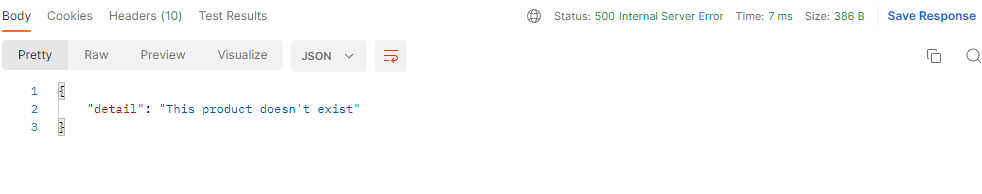

#### Deletar produtos ####
Para deletar os produtos existentes você deve utilizar o End-Point principal, passando na URL o ID do produto específico que deseja deletar
- http://localhost/api/products/{ID}/ (MÉTODO HTTP DELETE)

OBS: Para deletar produtos só é possivel tendo o produto já cadastrado no banco de dados, caso não tenha, você será avisado.

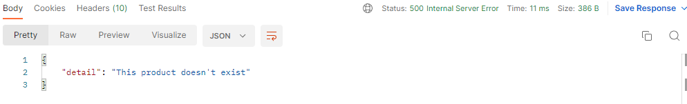

## Vendas ##
Para adicionar e ver as vendas do seu mercadinho, você deve utilizar as rotas com o End-Point:
- /api/sales/

#### Visualizar vendas ####
Para visualizar as vendas que aconteceram você deve utilizar o método HTTP GET no End-Point acima para visualizar todas as vendas cadastradas.
- http://localhost/api/sales/ (MÉTODO HTTP GET) 

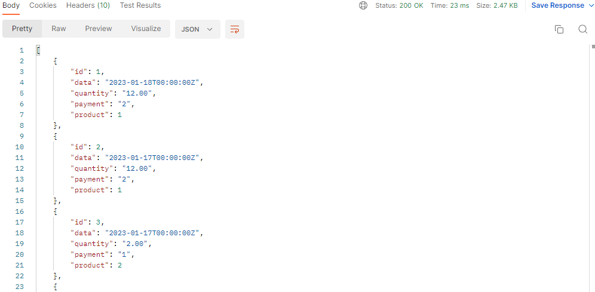

#### Adicionar vendas ####
Para adicionar as vendas você deve utilizar o End-Point principal descrito acima e passar um JSON com os parametros necessários para o lançamento de vendas
- http://localhost/api/sales/ (MÉTODO HTTP POST)

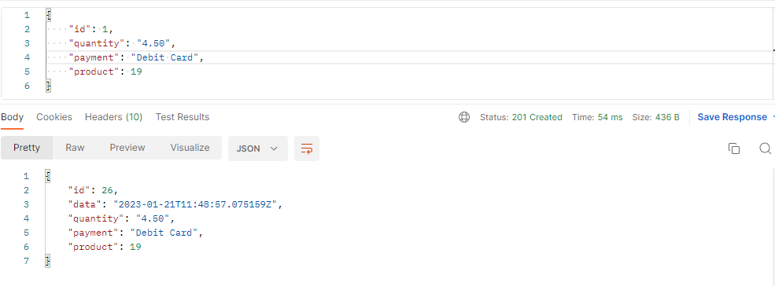

OBS: O lançamento de vendas só é possivel tendo o produto já cadastrado no banco de dados, caso não tenha, você será avisado.

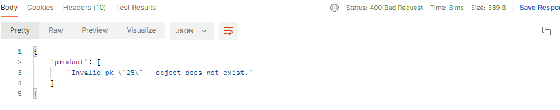

OBS: O lançamento de vendas só é possivel caso o produto tenha estoque suficiente para a sua compra

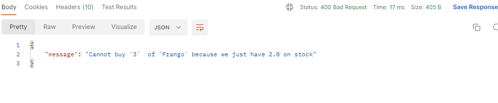

## Relatórios ##
Para ver e filtrar os relatorios do seu mercadinho, você deve utilizar as rotas com o End-Point:
- /api/sales/

#### Visualizar relatórios ####
Para visualizar todos os relatórios que aconteceram você deve utilizar o método HTTP GET no End-Point acima para visualizar todos os relatórios.
- http://localhost/api/reports/ (MÉTODO HTTP GET) 

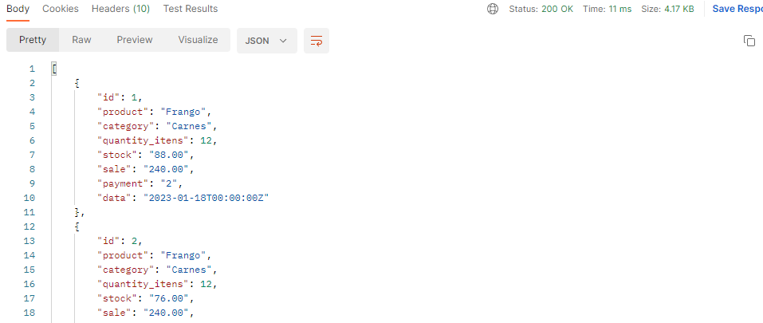

#### Filtrar relatórios ####
Para filtrar os relatórios você deve utilizar o End-Point principal descrito acima e passar um JSON com os parametros que você deseja filtrar, como data, pagamento, produto, etc. 
- http://localhost/api/reports/ (MÉTODO HTTP POST)

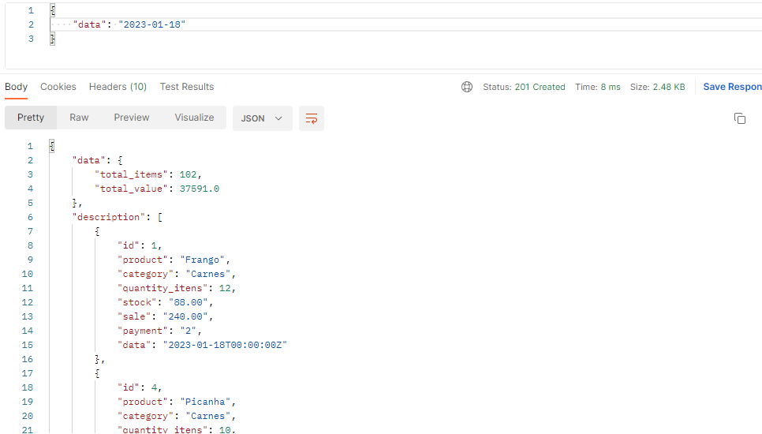

Na imagem abaixo está um JSON com todos os parâmetros disponíveis.

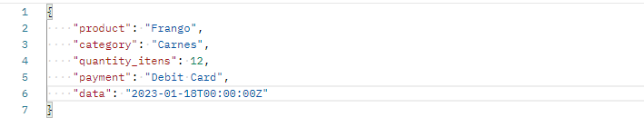

